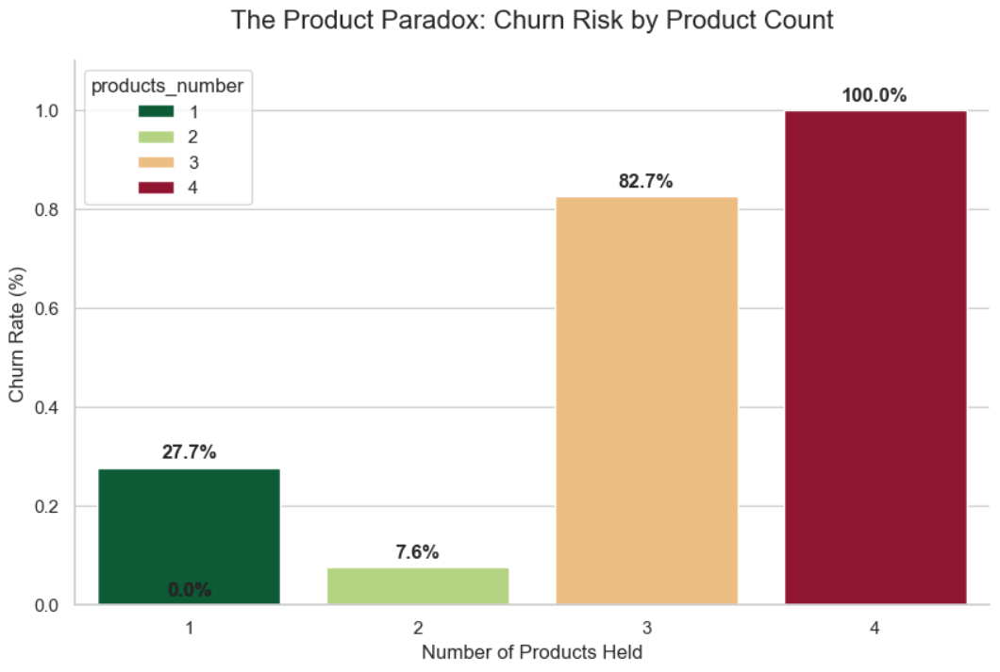
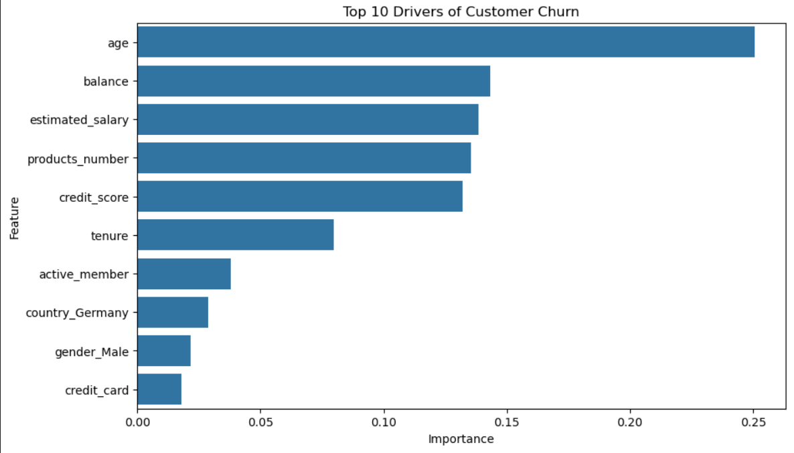

📉 Bank Customer Risk & Churn Modeling
An analysis of banking customer churn

This project uses the Bank Customer Churn Dataset download from Kaggle at presented by Gaurav Topre at: https://www.kaggle.com/datasets/gauravtopre/bank-customer-churn-dataset/data
Special Thanks to Gaurav Topre for providing it.

Strategic Analysis: The "Saturation Ceiling"
The most significant finding of this study is the identification of a 100% Attrition Rate among customers holding four or more products. While traditional banking KPIs often prioritize "product per household" as a measure of stickiness, this data suggests a dangerous Saturation Ceiling.

Key Insights:
The Loyalty Sweet Spot (2 Products): Customers with exactly two products represent the bank's most stable segment, with a churn rate of only 7.6%. This suggests a balanced relationship where the customer is integrated but not over-leveraged.

The Critical Failure Point (3+ Products): As product count increases beyond two, churn risk scales exponentially rather than linearly. The jump from 7.6% to 100% churn for 4-product holders indicates that high product density is a leading indicator of relationship dissolution.

Business Recommendations:
For customers already holding two products, the focus should shift from "Quantity" to "Quality of Service."

Automated Risk Triggers: Any customer moving from 2 to 3 products should be flagged for a proactive "Success Call" from a Relationship Manager to ensure the onboarding of the new product is seamless.

Audit the "4th Product": Investigate if a specific 4th product (e.g., a specific high-fee loan or complex insurance rider) is the primary driver of friction.



While 2 products represent the 'Loyalty Sweet Spot' (7.6% churn), account consolidation into 3 or 4 products serves as a 90%+ reliable leading indicator of imminent attrition.

Direct correlation to Churn is seen below.

```
Feature           correlation
churn               1.000000  
age                 0.285323   
country_Germany     0.173488   
balance             0.118533
estimated_salary    0.012097
credit_card        -0.007138
tenure             -0.014001
credit_score       -0.027094
products_number    -0.047820
country_Spain      -0.052667
gender_Male        -0.106512
active_member      -0.156128
```
This suggests that the bank should put focus on retaining older customers, customers in Germany, and proactively engaging members with low activity.

1. The Power Drivers (High Correlation & Importance)
Age (+0.28): The strongest linear predictor. Risk increases significantly as customers age, suggesting a need for "Legacy" or "Wealth Management" retention products for older demographics.

2. Active Membership (-0.16): The strongest defensive metric. Active engagement is the best "vaccine" against churn.

3. The "Non-Linear" Anomalies (High Branching, Low Correlation)
Estimated Salary: Despite a near-zero linear correlation (0.012), the Random Forest utilized this feature heavily for data partitioning.

Strategic Recommendations:
Targeted Re-engagement: Focus on Inactive Members in Germany (Country_Germany has a +0.17 correlation with churn).

Insight: Salary acts as a "modifier" rather than a direct driver. It doesn't cause churn on its own, but it refines the risk profile when combined with other factors like balance or products_number. This point is illustrated by its high branching value in the random forest model.


Model Architecture: Random Forest Classifier

Mechanism: Utilized an ensemble of 100 Decision Trees with Bootstrapped Sampling to ensure model stability.

Optimization: Implemented Balanced Class Weighting to account for the 4:1 imbalance between retained and churned customers, prioritizing Recall to identify at-risk users.


